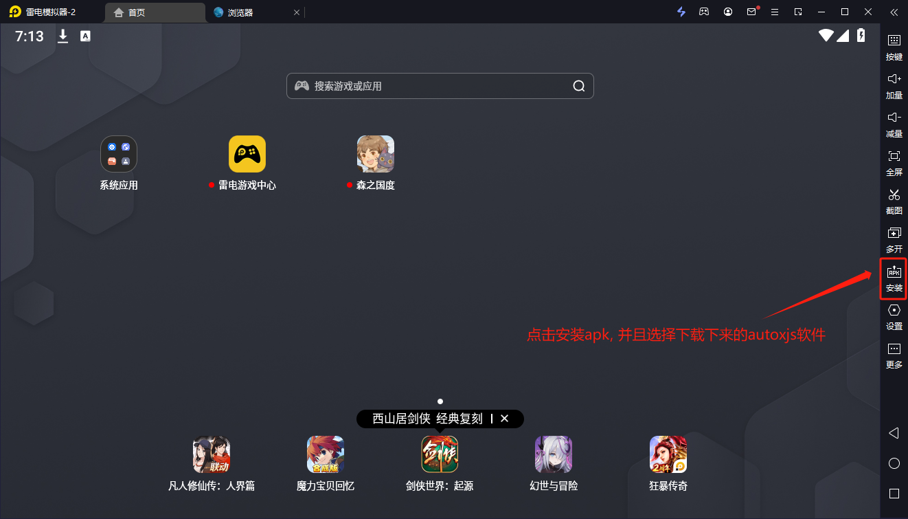

# 开始

1. PC中下载两个软件
   1. 雷电模拟器(官网地址: https://www.ldmnq.com)
     
   2. autoxjs(下载地址: https://github.com/kkevsekk1/AutoX/releases/download/6.5.2/app-v6-universal-release-unsigned-signed.apk)
2. 安装雷电模拟器
3. 打开雷电模拟器, 下载森之国度到模拟器中(视频操作)

    森之国度地址: https://szgd.lingxigames.com/website

    [下载雷电模拟器.mp4](%CF%C2%D4%D8%C0%D7%B5%E7%C4%A3%C4%E2%C6%F7.mp4)

4. 安装森之国度到模拟器中
5. 安装autojs到模拟器中
    
6. 打开autoxjs软件并且给予权限

    [打开autoxjs软件并且给予权限.mp4](%B4%F2%BF%AAautoxjs%C8%ED%BC%FE%B2%A2%C7%D2%B8%F8%D3%E8%C8%A8%CF%DE.mp4)
7. autoxjs执行下载脚本命令
    ```js
        var LAST_RELEASE_ID_FILE_PATH = "".concat(files.cwd(), "/szgd-assistance/.last_release_id");
/**
* 进行热更新/下载
  */
  function hotUpdate() {
  // 先判断是否有文件
  if (!files.isFile(LAST_RELEASE_ID_FILE_PATH)) {
  toast('初次使用, 开始安装脚本');
  }
  var needUpdate = checkUpdate();
  if (!needUpdate) {
  console.log('无需更新');
  return;
  }
  // 先从github releases获取最新的版本信息
  var result = http.get('https://api.github.com/repos/rabbitkiller-dev/szgd-assistance/releases/latest');
  var releasesDetailVO = result.body.json();
  var assets = releasesDetailVO.assets[0];
  toast("\u811A\u672C\u6709\u66F4\u65B0. \u6B63\u5728\u66F4\u65B0\u7248\u672C\u4E3A: ".concat(releasesDetailVO.tag_name));
  if (assets) {
  console.log(assets);
  downloadFile(assets.browser_download_url);
  }
  }
  /**
* 判断是否需要更新
* 通过比较release资源id来判断, 每次更新信息都在szgd-assistance目录中
  */
  function checkUpdate() {
  var result = http.get('https://api.github.com/repos/rabbitkiller-dev/szgd-assistance/releases/latest');
  var releasesDetailVO = result.body.json();
  var assets = releasesDetailVO.assets[0];
  // 先判断是否有文件
  if (!files.isFile(LAST_RELEASE_ID_FILE_PATH)) {
  return true;
  }
  if (assets) {
  var lastReleaseId = assets.id;
  var currentReleaseId = files.read("".concat(files.cwd(), "/szgd-assistance/.last_release_id"));
  return lastReleaseId !== currentReleaseId;
  }
  return false;
  }
  function downloadFile(url) {
  toastLog('开始下载');
  var response = http.get(url);
  var zipFile = response.body.bytes();
  var filepath = "".concat(files.cwd(), "/szgd-assistance.zip");
  var folderPath = "".concat(files.cwd());
  // path= /storage/emulated/0/脚本/zip文件专用/test.zip
  files.writeBytes(filepath, zipFile);
  toastLog('下载完成');
  toastLog('开始解压');
  switch (zips.X(filepath, folderPath)) {
  case 0:
  toastLog("解压缩成功！请到 " + folderPath + " 目录下查看。");
  break;
  case 1:
  toastLog("压缩结束，存在非致命错误（例如某些文件正在被使用，没有被压缩）");
  break;
  case 2:
  toastLog("致命错误");
  break;
  case 7:
  toastLog("命令行错误");
  break;
  case 8:
  toastLog("没有足够内存");
  break;
  case 255:
  toastLog("用户中止操作");
  break;
  default: toastLog("未知错误");
  }
  console.log(folderPath);
  return folderPath;
  }
  // hotUpdate();
```
